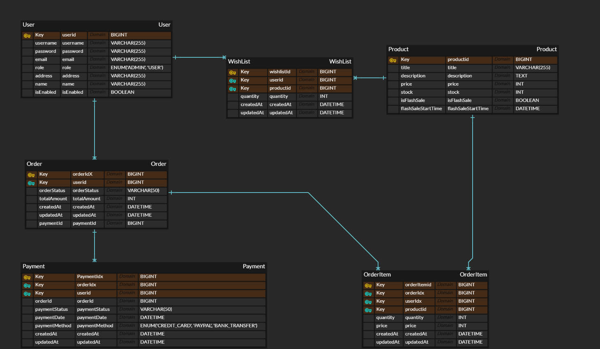

# WhiteMonday - 선착순 구매 e-commerce
## 🔎 프로젝트 소개
### 프로젝트 인원 : 1인 (개인)
- WhiteMonday는 빠르게 변화하는 e-commerce 환경에서 **대규모 트래픽**과 **선착순 구매**를 안정적으로 처리하는 것을 목표로 개발된 프로젝트입니다.
- 마이크로서비스 아키텍처(MSA)를 도입하여 트래픽이 몰리는 상황에서도 안정적인 사용자 경험을 목표로 합니다

## 🎯 프로젝트 기간
- 1차 MVP 개발 기간 : 2024.12.18 ~ 2025.01.31
- 2차 MVP 개발 기간 : 2025.05.15 ~ 2025.07.03
- 3차 MVP 개발 기간 : 2025.11.19 ~ 진행 중

<details>
  <summary>🎇 프로젝트 실행 방법</summary>

### 1️⃣ Git Clone
  ```bash
  git clone https://github.com/rorrxr/WhiteMonday.git
```

### 2️⃣ .env 파일 설정

```
# Docker
MYSQL_ROOT_PASSWORD={데이터베이스 비밀번호}
MYSQL_DATABASE={데이터베이스 이름}

DB_USERNAME={데이터베이스 username}
DB_PASSWORD={username의 비밀번호}

# SMTP
MAIL_USERNAME={SMTP 메일 송신 이메일}
MAIL_PASSWORD={SMTP 메일 송신 비밀번호}

# JWT Secret Key
JWT_SECRET_KEY={JWT KEY값}

# Encryption Secret Key
ENCRYPTION_SECRET_KEY={암호화 KEY값}

# 스프링 데이터베이스 URL
SPRING_DATASOURCE_URL=jdbc:mysql://localhost:3306/{데이터베이스 이름}?useSSL=false&allowPublicKeyRetrieval=true
```

### 3️⃣ Docker 이미지 빌드
``` bash
docker buildx build --platform linux/amd64 -f eureka-server/Dockerfile -t eureka-server:latest . --load
docker buildx build --platform linux/amd64 -f gateway-service/Dockerfile -t gateway-service:latest . --load
docker buildx build --platform linux/amd64 -f product-service/Dockerfile -t product-service:latest . --load
docker buildx build --platform linux/amd64 -f user-service/Dockerfile -t user-service:latest . --load
docker buildx build --platform linux/amd64 -f order-service/Dockerfile -t order-service:latest . --load
docker buildx build --platform linux/amd64 -f wishlist-service/Dockerfile -t wishlist-service:latest . --load
docker buildx build --platform linux/amd64 -f payment-service/Dockerfile -t payment-service:latest . --load
```

### 4️⃣ Docker Compose로 컨테이너 실행
```bash
docker-compose up --build -d
```    
</details>

## 🛠 아키텍처


## 🔗 ERD


## 🚀 주요 기능
### 📌 사용자 관리
- Google SMTP를 사용한 이메일 인증 기반 회원가입
- AES 알고리즘을 사용하여 개인정보 암호화 저장
- JWT, Spring Security 기반 로그인 및 로그아웃
### 📌 상품 관리
- 선착순 구매 상품 및 일반 상품 구분 관리
- Redis 캐싱 기반 실시간 재고 업데이트
- 위시리스트 조회 및 관리
- 상품 목록 및 상세 페이지 제공
### 📌 주문 및 결제
- 분산 락 기반 동시성 제어로 정확한 주문 처리
- Kafka 이벤트 드리븐 아키텍처 기반 비동기 결제 처리
- 주문 상태 실시간 추적 (결제 중, 배송 중, 배송 완료 등)
- 주문 취소 및 환불 처리

### 📌 모니터링 및 장애 관리
- Prometheus + Grafana 기반 실시간 모니터링
- Circuit Breaker를 활용한 장애 전파 차단
- Retry 패턴으로 일시적 장애 자동 복구

## 💻 기술 스택
- Backend : JAVA 21, Spring Boot 3.3.6, Spring Security, Spring Data JPA, Spring Cloud Netflix Eureka Client, JWT, CircuitBreaker
- Database : MySQL, Redis, DBeaver, Kafka
- Test Tool : Postman, K6, JUnit
- DevOps : Docker, Git, Prometheus, Grafana
- ETC : InteliJ, Google SMTP


## ❓ 기술적 의사결정

<details>
<summary> 1️⃣ MSA 도입 계기</summary>
    WhiteMonday 프로젝트에서 마이크로서비스 아키텍처(MSA)를 도입한 이유는 e-commerce 환경에서 요구되는 확장성과 안정성을 확보하기 위함입니다. MSA는 서비스 단위를 독립적으로 설계하고 운영할 수 있어, 특정 서비스의 변경이나 장애가 발생해도 다른 서비스에 미치는 영향을 최소화할 수 있습니다.
    <br><br>
    특히, 핫딜 이벤트와 같이 트래픽이 급증하는 상황에서 MSA의 개별 서비스 확장 기능이 큰 이점을 제공합니다. 예를 들어, 상품 관리 서비스에 트래픽이 집중되는 경우 해당 서비스만 수평 확장을 통해 대응함으로써 전체 시스템의 안정성을 유지할 수 있었습니다.
    <br><br>
    또한, MSA는 장애 격리에 유리하여 특정 서비스에서 문제가 발생하더라도 나머지 서비스는 정상적으로 동작할 수 있어 사용자 경험을 보호할 수 있습니다. 이러한 구조는 대규모 트래픽과 복잡한 비즈니스 로직이 요구되는 e-commerce 프로젝트에 특히 적합합니다.
    <br><br>
    결론적으로 MSA를 통해 확장성과 안정성을 동시에 확보하며, 복잡한 비즈니스 요구사항을 충족하는 아키텍처를 구축하고 있습니다.
</details>

<details>
  <summary> 2️⃣ Spring Boot</summary>
  Spring Boot는 생산성, 확장성, 그리고 Spring 생태계와의 통합성 측면에서 우수하여 주요 프레임워크로 선정되었습니다. Spring Boot의 자동 설정 기능과 내장 서버는 초기 개발 과정을 단순화하고 빠른 프로토타이핑을 가능하게 했습니다.
    <br><br>
    또한, Spring Framework의 풍부한 기능을 활용해 MSA 환경에서 마이크로서비스 간 통신(예: Feign Client)이나 분산 시스템 구현을 간소화했습니다. 높은 유연성을 제공함으로써 프로젝트 요구사항의 변화에도 쉽게 대응할 수 있었으며, 커뮤니티와 문서 지원을 통해 개발 중 발생한 문제를 신속히 해결할 수 있었습니다.
    <br><br>
    이와 함께, 지속적인 업데이트와 보안 패치 제공을 통해 안정성과 신뢰성을 보장할 수 있어 Spring Boot를 프로젝트의 핵심 프레임워크로 채택했습니다.
</details>

<details>

  <summary> 3️⃣ Spring Boot 3.3.6과 JAVA 21 버전 선택</summary>
      Spring Boot 3.3.6과 Java 21의 조합은 프로젝트에서 발생했던 호환성 문제를 해결하기 위해 선택되었습니다.
    <br><br>
    초기 개발 과정에서 Feign Client 통신 및 일부 Spring Boot 기능이 예상대로 동작하지 않는 문제가 있었으며, 이는 사용 중인 Spring Boot와 Java 버전 간의 호환성 문제로 확인되었습니다. Spring Boot 3.3.6은 최신 LTS(Lifecycle Support)를 지원하며, Java 21은 Long-Term Support 버전으로 최신 기능과 안정성을 제공합니다. 두 버전 간 상호 호환성이 보장될 뿐만 아니라 성능 최적화와 보안 패치 측면에서도 우수한 선택이었습니다.
    <br><br>
    이를 통해 Feign Client 통신 문제를 비롯한 여러 기술적 문제를 해결할 수 있었으며, 안정성과 성능 모두를 확보한 아키텍처를 구현할 수 있었습니다.
</details>

<details>
  <summary> 4️⃣ MySQL (RDBMS)</summary>

MySQL은 데이터의 일관성을 유지하고 핵심 데이터를 안정적으로 관리하기 위해 선택되었습니다. <br><br>
상품 정보와 주문 데이터를 정규화된 테이블 구조로 관리함으로써 데이터 무결성을 보장하였으며, JPA를 통해 데이터 관리와 비즈니스 로직을 효율적으로 처리할 수 있었습니다.<br><br>
또한, 검증된 안정성과 데이터 보존 및 백업 용이성을 바탕으로 주요 데이터를 안전하게 저장하고 유지할 수 있었습니다.
</details>


<details>

  <summary> 5️⃣ Redis (NoSQL)</summary>
  Redis는 실시간 데이터 캐싱을 통해 시스템 성능을 최적화하기 위해 도입되었습니다. 
    <br><br>
    대규모 트래픽 상황에서 자주 조회되는 재고 정보를 캐싱하여 데이터베이스 접근을 줄이고 빠른 응답 속도를 보장할 수 있었습니다. 
    <br><br>
    또한, Redis의 분산 락 기능을 활용해 동시성 제어 문제를 해결하였으며, 간단한 구현과 뛰어난 성능 덕분에 효율적으로 동시성 문제를 처리할 수 있었습니다. Redis는 읽기 요청을 처리하고 MySQL은 쓰기 작업을 담당하도록 설계하여, 데이터 일관성과 성능의 균형을 유지했습니다.
</details>

<details>
  <summary> 6️⃣ MySQL (RDBMS)과 Redis (NoSQL) 병행 사용 선택</summary>

MySQL과 Redis를 병행 사용한 이유는 각각의 장점을 살리면서 데이터 일관성과 성능을 동시에 확보하기 위함입니다.

MySQL은 주문 및 결제와 같은 핵심 데이터를 안전하게 관리하며, Redis는 빠른 데이터 조회와 캐싱을 통해 높은 트래픽에도 안정적인 성능을 제공할 수 있었습니다. 이 설계를 통해 대규모 트래픽 상황에서도 안정성과 확장성을 모두 달성할 수 있었습니다.
</details>

<details>
    <summary> 7️⃣ Feign Client</summary>
    Feign Client는 간결하고 직관적인 선언적 API 클라이언트를 제공하여 코드의 가독성과 유지보수를 크게 개선했습니다. 
    <br><br>
    이를 통해 서비스 간 통신을 효율적으로 처리할 수 있었으며, MSA 환경에서 반복적으로 발생하는 통신 관련 로직을 간소화할 수 있었습니다.
</details>

<details>
      <summary> 8️⃣ K6</summary>
    k6는 성능 테스트의 간편한 구현과 효율적인 리소스 사용을 위해 선택되었습니다. JavaScript 기반의 직관적인 스크립트 작성과 간단한 CLI 환경은 초기 학습 비용을 줄이고 빠르게 테스트를 시작할 수 있도록 도와줍니다.
    <br><br>
    고성능 C++ 기반으로 개발된 k6는 동시 사용자(VU) 시뮬레이션에 최적화되어 있어 대규모 테스트 환경에서도 안정적으로 동작하며, Prometheus 및 Grafana와 같은 모니터링 도구와의 통합을 통해 실시간 데이터 시각화와 분석이 가능합니다.
    <br><br>
    또한, 사용자 정의가 용이하여 복잡한 테스트 시나리오를 구현할 수 있었으며, 오픈소스 기반으로 커뮤니티 지원과 지속적인 업데이트를 통해 최적의 성능 테스트 환경을 구축할 수 있었습니다.
</details>

<details>
      <summary> 9️⃣ Kafka </summary>
  Kafka와 SAGA 패턴은 주문 → 결제 → 재고 반영 과정에서 발생하는 동기 처리의 성능 병목과 트랜잭션 관리 문제를 해결하기 위해 도입되었습니다. <br>

WhiteMonday 프로젝트에서는 사용자의 주문 요청이 들어오면, 결제 승인과 재고 차감이 순차적으로 이루어지는 구조였습니다. 이 과정에서 하나의 단계에서 지연이 발생하면 전체 프로세스가 지연되는 문제가 발생했고, 특히 결제 승인 지연 또는 재고 서비스의 응답 지연으로 인해 사용자 응답 시간이 비정상적으로 늘어나는 성능 병목이 발생했습니다.<br>

또한, 각 서비스가 독립적인 DB를 사용하는 MSA 구조에서 단일 트랜잭션으로 묶어 처리할 수 없기 때문에 데이터 일관성 보장이 어려운 상황이었습니다.<br>

Kafka 기반 비동기 메시징 도입과 SAGA 패턴 적용을 통한 분산 트랜잭션 보상 처리를 적용하여 전체 요청 처리 시간을 동기 구조 대비 대폭 단축시키고, 서비스 간의 느슨한 결합을 유지하면서도 데이터 정합성 확보와 대용량 주문 요청에 대해 확장성과 장애 대응력 확보하였습니다.
<br>
</details>

<details>
      <summary> 1️⃣0️⃣ Prometheus와 Grafana </summary>
  Prometheus와 Grafana는 MSA 환경에서 실시간 모니터링과 장애 대응 체계를 구축하기 위해 도입되었습니다.<br><br>

WhiteMonday 프로젝트는 다수의 마이크로서비스가 상호작용하는 구조로, 특정 서비스의 장애가 연쇄적으로 다른 서비스에 영향을 미칠 수 있는 리스크가 존재했습니다. 이에 따라 **문제가 발생하기 전에 사전 징후를 탐지하고, 실시간으로 시스템 상태를 시각화하여 빠르게 대응**할 수 있는 모니터링 시스템의 필요성이 대두되었습니다. <br><br>

Prometheus는 시계열 기반의 메트릭 수집 도구로, 애플리케이션의 다양한 지표(요청 수, 응답 시간, 에러율 등)를 정기적으로 수집하고 저장합니다. Grafana는 이러한 데이터를 시각화하는 대시보드 도구로, 서비스의 상태를 직관적으로 확인할 수 있도록 도와줍니다.
<br>
</details>

<details>
      <summary> 1️⃣1️⃣ CircuitBreaker </summary>
MSA 환경에서 특정 서비스가 일시적으로 장애를 겪거나 응답 지연이 발생할 경우 전체 흐름이 중단되는 문제가 존재했습니다. <br>

이를 해결하기 위해 Resilience4j의 Circuit Breaker와 Retry 기능을 도입하여 장애 대응 체계를 구축하였습니다. <br>

일시적인 장애나 과부하로 인해 특정 서비스의 실패율이 증가할 경우, 해당 서비스에 대한 호출을 차단하고 fallback 로직으로 우회 처리하도록 설계하였습니다. <br>

이를 통해 실패한 서비스에 불필요한 호출을 반복하지 않음으로써, 시스템 자원 낭비를 방지하고 전체 서비스 장애 확산을 차단할 수 있었습니다.<br>

반대로, 네트워크 일시적 불안정 또는 순간적인 서비스 오류와 같이 일회성 장애는 재시도를 통해 정상 처리가 가능한 상황이 많았습니다. <br>

이러한 경우를 고려하여 일정 횟수 자동 재시도 후 처리되도록 @Retry 설정을 적용하였고, 재시도 후에도 실패할 경우에는 fallback 함수로 graceful하게 실패 처리하도록 구성하였습니다. <br>

결국 Circuit Breaker는 지속적인 장애에 대한 보호, Retry는 일시적인 장애에 대한 회복을 목적으로 선택하였으며, 서비스 간 연쇄 장애 방지 및 복원력 확보와 사용자 응답 실패율 감소 서비스 안정성 향상 및 예외 상황 대응 자동화를 위해 선택하게 되었습니다.
<br>
</details>

## 📃 API 설계서

[🔗 API 설계서 LINK](https://documenter.getpostman.com/view/39655317/2sAYX2N4Lg)

### 주요 엔드포인트
- **User Service**: 회원가입, 로그인, 프로필 관리
- **Product Service**: 상품 조회, 재고 확인
- **Order Service**: 주문 생성, 주문 조회, 주문 취소
- **Payment Service**: 결제 처리, 결제 내역 조회
- **Wishlist Service** : 위시리스트 조회
- **Cart Service** : 장바구니 상품 추가, 조회, 삭제, 수량 변경

## 🚨 트러블 슈팅

### 1️⃣ Redis 캐싱으로 재고 조회 성능 개선

**[Issues]**
- **DB 병목 발생**: 재고 데이터를 MySQL에서 직접 조회하면서 트래픽 증가 시 데이터베이스 I/O 부하 급증
- **대규모 트래픽 성능 저하**: 트래픽 증가 시 평균 응답시간 응답시간 1.27초 기록 → 사용자 이탈 우려
- **수평적 확장(Scale-Out) 제약**: 단일 데이터베이스 구조로 인한 확장성 한계
- **[Before] 성능 테스트 결과**:
    - **TPS**: 182.85/sec
    - **평균 요청 응답 시간**: 1.27s

**[Solutions]**
1. **DB 직접 조회** : 구현이 간단하며 데이터 정합성 100%지만 트래픽 증가 시 병목 및 확장이 어려움
2. **Redis 캐싱** : 응답이 빠르고 DB 부하가 감소하지만 캐시-DB 불일치 가능성
3. **Redis + CDC** : 완벽한 동기화지만 구현 복잡도가 높으며 운영 비용에 부담이 생김

**[Choice] Redis Cache-Aside + Write-Through**
- **Cache-Aside 패턴**: 자주 조회되는 재고 데이터를 Redis에 저장. 캐시 미스 발생 시 DB에서 조회 후 캐시 업데이트
- **Write-Through 패턴**: DB와 Redis에 동기적으로 업데이트하여 데이터 일관성 보장
- **동적 TTL 전략**: 재고 수량에 따라 캐시 만료 시간 차등 적용으로 실시간성 확보

**[Solve]**:
- `RedisTemplate`을 사용해 Cache-Aside 전략으로 데이터 캐싱.
- 조회 요청 시 Redis에서 캐싱된 데이터를 반환해 DB 조회 빈도를 감소.
- 초기 상품 등록 시 Redis에 재고를 저장하여 빠른 조회가 가능하도록 구성.

**[After] 성능 테스트 결과**
- **TPS**: 503.35/sec (182.85/sec → 503.35/sec TPS 175% 증가)
- **평균 요청 응답 시간**: 133.1ms (1.27s → 133.1ms 89.5% 감소)
---
### 2️⃣ 주문-결제 성능 최적화

**[Issues]**

- **Lock Contention**: 주문 처리 시 데이터베이스 락으로 인한 높은 지연 시간
- **동시성 문제**: 데이터 일관성 문제 발생
- **순차 처리 병목**: 주문 → 재고 감소 → 결제가 동기 방식으로 처리되어 전체 응답 시간 누적

**[Solutions]**
1. **FeignClient 동기 방식** : 구현이 간단하고 데이터 정합성 명확하지만 연쇄 지연 및 장애 전파 가능
2. **FeignClient @Async 방식** : 비동기 응답 방식이 장점이지만 트랜잭션 관리가 복잡하며 실패 추적이 어려움
3. **Kafka 비동기 방식** : 완전한 장애 격리가 가능하고 확장성이 좋지만 구현 복잡도 높으며 이벤트 유실 가능성 있음

**[Choice] Kafka 비동기 방식 (Kafka +SAGA 구조)**

**[SAGA 패턴 + Choreography 방식]**
- **분산 트랜잭션 관리**: 각 서비스가 로컬 트랜잭션 실행 후 이벤트 발행
- **보상 트랜잭션**: 실패 시 이전 단계 롤백 이벤트 발행
- **Choreography 방식 선택**: 중앙 오케스트레이터 제거로 단일 장애 지점(SPOF) 방지하고 서비스 간 결합도를 최소화하여 독립 배포 및 확장성 확보

**[Outbox 패턴]**
- 원자성 보장: 비즈니스 로직과 Outbox 저장을 같은 트랜잭션에서 처리
- 이벤트 발행: @TransactionalEventListener(afterCommit)로 트랜잭션 커밋 후 Kafka 발행
- 실패 복구: Outbox 상태 관리로 발행 실패 시 재시도 가능

**[Solve]**:
- 주문 생성 시 Kafka의 order-created-topic에 이벤트 발행
- 결제 서비스는 해당 이벤트를 비동기적으로 수신 후 결제 처리
- 결제 성공/실패 결과를 다시 이벤트로 발행하여 이후 단계(재고 감소 또는 보상 처리) 진행

- **[Outcomes]**:
    - 각 서비스 간 느슨한 결합 → 장애 전파 최소화.
    - 대규모 트래픽 상황에서도 안정적인 트랜잭션 처리.
    - 확장성과 유연성 확보.

---

### 3️⃣ 장애 대응 문제 해결 및 회복 탄력성 확보

**[Issues]**

- **연쇄 장애**: 하나의 서비스 장애가 다른 서비스로 전파되어 전체 시스템 마비 위험
- **불필요한 재시도**: 장애 발생 서비스에 계속 요청을 보내 시스템 자원 낭비
- **장애 감지 지연**: 서비스 장애 발생 시점과 감지 시점 간 시간차로 인한 장애 확산

**[Solutions]**
1. **FeignClient 타임아웃만** : 구현이 간단하지만 장애가 전파되거나 자원 낭비
2. **Retry만** : 일시적 장애 복구는 가능하지만 장기 장애 발생 시 무한 재시도
3. **Circuit Breaker만** : 장애가 격리 가능하지만 일시적 오류도 차단
4. **Circuit Breaker + Retry** : 완전한 회복 탄력성 구조이지만 설정 복잡도 높음
5. **Prometheus + Grafana 모니터링**: Circuit Breaker, Retry, Timeout 메트릭을 실시간 수집과 장애 징후를 사전에 감지하여 빠른 대응 가능

**[Choice] Resilience4j Circuit Breaker + Retry + Prometheus/Grafana 모니터링**
- **장애 격리**: 결제 서비스 다운 시에도 주문 접수 가능
- **자원 절약**: 불필요한 호출 차단으로 CPU 사용률 30% 감소
- **사용자 경험**: 즉시 Fallback 응답으로 대기 시간 제거
- **실시간 모니터링**: 장애 조기 감지 및 빠른 대응

**[Solve]**

**1. Resilience4j의 CircuitBreaker**
- 외부 서비스 호출 실패율이 50% 초과 시 자동으로 회로 차단
- Half-Open 상태에서 시험 요청으로 서비스 복구 여부 확인
- Closed 상태로 복구 시 정상 요청 재개

**2. Fallback 메서드 구현**
- 결제 서비스 장애 시 주문을 "결제 대기" 상태로 보관 후 복구 시 재처리
- 재고 서비스 장애 시: 캐시된 재고 정보로 임시 응답

**3. Retry 패턴 조합**
- 일시적 네트워크 오류는 3회까지 자동 재시도
- 3회 실패 후 Circuit Breaker 작동

**4. Prometheus + Grafana 모니터링 강화**
- Prometheus 주요 메트릭
    - Circuit Breaker 상태(Open / Half-Open / Closed)
    - 외부 서비스 호출 실패율
    - 평균 응답 시간(P95, P99)
    - Retry 횟수

- Grafana 대시보드 구성
    - 실패율 30% 초과 시 경고(Alert)
    - Circuit Breaker Open 전환 시 즉시 알림

**[Outcomes]**
- **장애 감지 시간 단축**: 장애 인지까지 평균 10분 → 1~2분
- **장애 전파 차단**: 결제 서비스 다운 시에도 주문 서비스 가용성 유지
- **응답 실패율 감소**: 타임아웃 오류 Fallback 처리
- **시스템 복원력 향상**: 평균 복구 시간 15분 → 2분
- **사용자 경험**: 장애 상황에서도 부분 기능 제공으로 완전 실패 방지
- **운영 가시성 확보**: 장애 원인(네트워크 / 타임아웃 / 외부 서비스)을 메트릭 기반으로 즉시 식별 가능
---

## ✅ 프로젝트 향후 개선 방안

### 1. 🔍 QueryDSL 도입으로 쿼리 최적화

- **[현재]**  
  복잡한 조건이나 동적 검색 쿼리를 JPQL 또는 Native Query로 직접 작성하고 있음

- **[이후]**  
  QueryDSL을 도입하여 가독성 높은 동적 쿼리 구성 및 재사용 가능한 조건 빌더 패턴 적용 예정

- **[기대효과]**
    - JPA의 정적 쿼리 한계를 보완하고, 유지보수성과 테스트 편의성 향상
    - 서비스별 공통 조건/정렬 처리 추상화로 재사용성 증가

---

### 2. 🚀 Kubernetes + Jenkins CI/CD 구축

- **[현재]**  
  Docker Compose를 활용한 로컬 중심 배포 및 수동 빌드 과정

- **[이후]**  
  Jenkins 기반 CI/CD 파이프라인 구성 후, Kubernetes 환경으로 클러스터 배포 전환 예정

- **[기대효과]**
    - 자동화된 테스트 및 배포로 신속한 배포 사이클 확보
    - 롤링 업데이트, Canary 배포, 오토스케일링 등 실무형 인프라 실습 가능

---

### 3. 📡 Zipkin 기반 분산 추적 및 장애 발생 위치 시각화

- **[현재]**  
  서비스 간 호출 흐름 추적 어려움 → 로그를 수동으로 추적 중

- **[이후]**  
  Spring Sleuth + Zipkin을 연동하여 호출 흐름 시각화 및 추적 시스템 구축

- **[기대효과]**
    - 장애 발생 위치 및 전파 지점을 빠르게 파악 가능
    - 호출 병목 구간 최적화 기반 마련

---

### 4. 📦 Elasticsearch + ELK 기반 고성능 검색 및 로그 분석

- **[현재]**  
  상품 검색 기능은 RDB 기반으로만 처리, 로그 분석은 수동 탐색

- **[이후]**  
  Elasticsearch 기반 상품 검색 API 구축 및 ELK 파이프라인 구성(Logstash → Elasticsearch → Kibana)

- **[기대효과]**
    - 빠른 검색 응답 및 복합 필터링 제공
    - 로그의 시계열 분석 및 트렌드 모니터링 가능

---